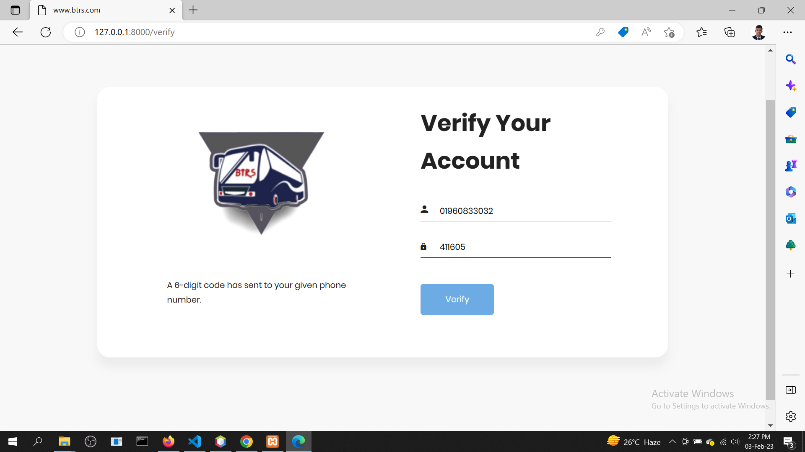
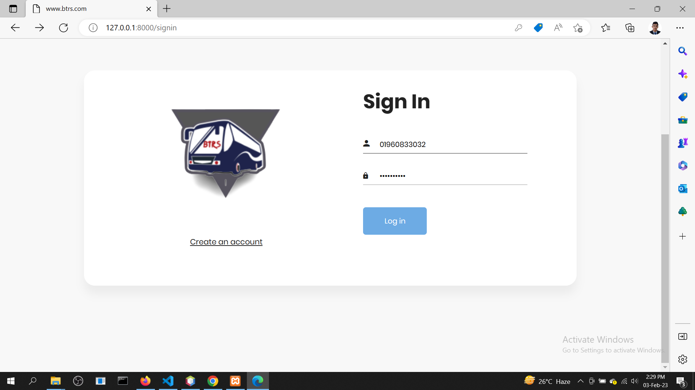
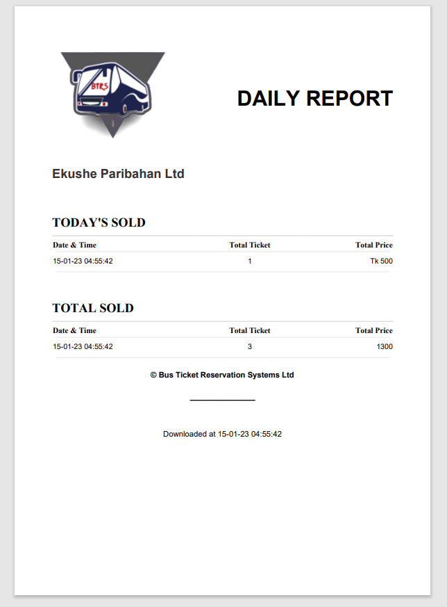

# Bus Ticket Reservation System

This is the project on the online ticketing system for various bus companies, which in most cases; a company has problems with their ticketing and scheduling process. This project intends to computerise its ticketing system to provide better customer service. Because of that, the company can provide an easier way of travelling to the customer or passenger. Electronic tickets, or e-tickets, give evidence that their holders have permission to enter a place of entertainment, use a means of transportation, or have access to some Internet services. Bus Ticket Reservation System enables the bus company's customer to buy bus ticket online-ticket is the easiest and quickest way to travel a bus. Currently, staff at the bus ticket counter are using an internal system to sell tickets at the counter. Customers are unable to buy bus tickets online at this moment and have to go to the counter to buy bus tickets. Sometimes, customers need to queue up in a long queue to buy bus tickets and ask for information. This brings a lot of inconvenience to the customers. 
Online Bus Ticket Reservation System enables the customer to buy bus tickets, make payment, cancel reservations and ask for information online easily. Furthermore, staff can sell bus tickets using Bus Ticket Reservation System after checking bus ticket availability for the customer and print the bus ticket to the customer that queues up at the counter.

# Objectives

The main objectives of the Bus Ticket Reservation System include:  

-> Providing a web-based bus ticket buying function.  
-> Customers can buy bus tickets through the online system and there is no need to queue up to buy bus tickets at the counter.  
-> Enabling customers to check the availability of the bus ticket online.   
-> Customers   can check the time of departure and arrival for every Transnational’s bus through the system.  
-> To ease the bus ticket payment via online.   
-> Customers have to pay the bus ticket by BKASH, ROCKET, SHURE CASH, NAGAD, or UPAY mobile banking service.  
-> To reduce the number of staff at the point of sale.   
-> The number of staff at the counter can be reduced after the online buying bus ticket system launch.  

# Features
The proposed system will have many features like the one discussed below:

## Home Page

## User Side

### Customer registration 

### Verification Message to the Phone Number

### Verify Account

### User log in

### Search for Booking 

### Search Result

### Seat Booking

### Online Payment Processing

#### Cart
ng

#### Payment Gateway
ng

#### Provide OTP
ng

#### Payment Success

### User Dashboard

### Booking Details (Ticket.pdf File)

## Admin Side

### Administrator Registration

### Administrator log in 

### Daily Report

### Add new Bus to service etc

### Bus Schedule add and update

### Admin Change 

